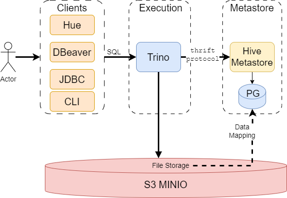

## Table of Contents

* [Overview](#overview)
* [User Guide](docs/public/user-guide.md)
* [Architecture](docs/public/architecture.md)
* [Installation Guide](docs/public/installation.md)
* [Helm Chart Customizations](#helm-chart-customizations)

## Overview
Trino is a distributed SQL query engine for Big Data analytics.  
It consists of coordinator, workers and a client should be used to submit queries to Trino.

This repo contains helm charts and images to run trino on kubernetes. The trino charts based on [trino charts](https://github.com/trinodb/charts) . The trino images include some additional improvements, for example, to work with S3 or with certificates.

The final helm chart for this project can be extracted from qubership-trino-on-k8s-transfer release image.

Trino's official documentation - https://trino.io/docs/current/overview.html.



---

## Helm Chart Customizations

This section documents the custom modifications made to the Trino Helm chart in this deployment, compared to the official [Trino charts](https://github.com/trinodb/charts)

### `values.yaml`

CUSTOM CHANGES: The following parameters have been added or modified to support our specific configuration requirements
```yaml
image:
    repository: ghcr.io/netcracker/qubership-trino
    tag: main
cloudIntegrationEnabled: false
server:
  node:
  config:
    http:
      port: 8080
    https:
      keystore:
        path: /etc/trino/certs/tls-combined.pem
    query:
      maxMemory: "2GB"
  coordinatorExtraConfig: |
    http-server.process-forwarded=IGNORE
s3: 
  endpoint: http://minio.your.cloud.qubeship.com
  accesskey: minioaccesskey
  secretkey: miniosecretkey
  region: region

hive:
  host: hive-metastore.hive-metastore.svc
  port: 9083
catalogs:
  hive: |
    connector.name=hive
    hive.metastore.uri={{ include "hive.metastore.uri" . }}
    hive.max-partitions-per-scan=1000000
    hive.storage-format=ORC
    hive.non-managed-table-writes-enabled=true
    fs.native-s3.enabled=true
    s3.endpoint={{ include "s3.endpoint" . }}
    s3.region={{ .Values.s3.region }}
    s3.aws-access-key={{ include "s3.accesskey" . }}
    s3.aws-secret-key={{ include "s3.secretkey" . }}
    s3.path-style-access=true
    s3.max-connections=100
 
containerSecurityContext:
  runAsNonRoot: true
  seccompProfile:
    type: RuntimeDefault
coordinator:
  priorityClassName: ~
  
  jvm:
    maxHeapSize: "1638M"
  resources:
    limits:
      cpu: 500m
      memory: 2G
    requests:
      cpu: 100m
      memory: 1512Mi
worker:
  priorityClassName: ~
  jvm:
    maxHeapSize: "2457M"
    
   resources:
    limits:
      cpu: 500m
      memory: 3G
    requests:
      cpu: 100m
      memory: 2G
jmx:
  
  exporter:
    image: bitnami/jmx-exporter:latest
commonLabels:
  app.kubernetes.io/part-of: trino
tls:
  enabled: false
  secretMounts:
    name: cert
    secretName: trino-server-tls-cert
    path: /etc/trino/certs/
  generateCerts:
    enabled: false
    secretName: trino-cm-tls-cert
    secretMounts:
      - mountPath: /home/trino/trustcerts/ca.crt
        subPath: ca.crt
      - mountPath: /etc/trino/certs/
    duration: 365
    subjectAlternativeName:
      additionalDnsNames: [ ]
      additionalIpAddresses: [ ]
    clusterIssuerName: common-cluster-issuer
```

---

### `_helpers.tpl`

```yaml
#--Qubership custom change---
{{ define "trino_image" -}}
{{ printf "%s:%v" (.Values.image.repository) (.Values.image.tag) }}
{{- end }}
#--Qubership custom change---

# Qubership custom change: custom values for MinIO S3
{{/*
MinIO S3 Endpoint
*/}}
{{- define "s3.endpoint" -}}
{{- .Values.s3.endpoint -}}
{{- end -}}

{{/*
MinIO S3 secretkey
*/}}
{{- define "s3.secretkey" -}}
{{- .Values.s3.secretKey -}}
{{- end -}}

{{/*
MinIO S3 accesskey
*/}}
{{- define "s3.accesskey" -}}
{{- .Values.s3.accessKey -}}
{{- end -}}

# Qubership custom change: custom values for Hive Metastore
{{/*
Hive Metastore URI
*/}}
{{- define "hive.metastore.uri" -}}
{{ printf "thrift://%s:%v" (.Values.hive.host) (.Values.hive.port) }} 
{{- end -}}


{{/*
Common labels
*/}}
{{- define "trino.labels" -}}
helm.sh/chart: {{ include "trino.chart" . }}
{{ include "trino.selectorLabels" . }}
{{- if .Chart.AppVersion }}
#--Qubership custom-label-value-change-
app.kubernetes.io/version: {{ splitList ":" ( include "trino_image" . ) | last | quote }}
#--Qubership custom-label-value-change-
{{- end }}
app.kubernetes.io/managed-by: {{ .Release.Service }}
{{- if .Values.commonLabels }}
{{ tpl (toYaml .Values.commonLabels) . }}
{{- end }}
{{- end }}

# Qubership custom change: Qubership release support
{{/*
To add to service labels for Qubership release
*/}}
{{- define "to_add_to_service_labels" -}}
name: {{ include "trino.name" . }}
{{- end }}

{{/*
To add to deployment label for Qubership release
*/}}
{{- define "to_add_to_deployment_labels" -}}
name: {{ include "trino.name" . }}
{{- end }}

{{/*
Processed by cert-manager label for Qubership release
*/}}
{{- define "cert_manager_label" -}}
app.kubernetes.io/processed-by-operator: cert-manager
{{- end }}
```
---

### `deployment-coordinator.yaml`

```yaml
metadata:
  labels:
# Qubership custom change: Qubership release support
    {{- include "to_add_to_deployment_labels" . | nindent 4 }}
spec: 
  template:
    metadata:
        labels:
            # Qubership custom change: Qubership release support
            {{- include "to_add_to_deployment_labels" . | nindent 8 }}
    spec:
      {{- if .Values.coordinator.priorityClassName }}
      priorityClassName: {{ .Values.coordinator.priorityClassName }}
      {{- end }}
      volumes: 
        {{- if and .Values.server.config.https.enabled .Values.tls.enabled }}
        {{- if not .Values.tls.generateCerts.enabled }}
        - name: {{ .Values.tls.secretMounts.name }}
          secret:
            secretName: {{ .Values.tls.secretMounts.secretName }}
        {{- end }}
        {{- end }}
        # Qubership custom change: support secure connections
        {{- if and .Values.tls.enabled .Values.tls.generateCerts.enabled }}
        - name: {{.Values.tls.generateCerts.secretName }}-volume
          secret:
            secretName: {{.Values.tls.generateCerts.secretName }}
        {{- end }}
        containers:
            - name: {{ .Chart.Name }}-coordinator
            volumeMounts:
                {{- if and .Values.server.config.https.enabled .Values.tls.enabled }}
            {{- if not .Values.tls.generateCerts.enabled }}
            - mountPath: {{ .Values.tls.secretMounts.path }}
              name: {{ .Values.tls.secretMounts.name }}
            {{- end }}
            {{- end }}
            # Qubership custom change: support secure connections
            {{- if and .Values.tls.enabled .Values.tls.generateCerts.enabled }}
            {{- range .Values.tls.generateCerts.secretMounts }}
            - name: {{ $.Values.tls.generateCerts.secretName }}-volume
              mountPath: {{ .mountPath }}
              {{- if .subPath }}
              subPath: {{ .subPath }}
              {{- end }}
            {{- end }}
            {{- end }}
            ports:
              protocol: TCP
            {{- if .Values.server.config.https.enabled }}
            - name: https
              containerPort: {{ .Values.server.config.https.port }}
              protocol: TCP
            {{- end }}
    
```

---

### `deployment-worker.yaml`

```yaml
metadata:
  
  labels:
    
# Qubership custom change: Qubership release support
    {{- include "to_add_to_deployment_labels" . | nindent 4 }}
spec:
  template:
    metadata:
        labels:
        
# Qubership custom change: Qubership release support
        {{- include "to_add_to_deployment_labels" . | nindent 8 }}
    spec:
      {{- if .Values.worker.priorityClassName }}
      priorityClassName: {{ .Values.worker.priorityClassName }}
      {{- end }}
      volumes:
        {{- if and .Values.server.config.https.enabled .Values.tls.enabled }}
        {{- if not .Values.tls.generateCerts.enabled }}
        - name: {{ .Values.tls.secretMounts.name }}
        secret:
          secretName: {{ .Values.tls.secretMounts.secretName }}
        {{- end }}
        {{- end }}
        # Qubership custom change: support secure connections
        {{- if and .Values.tls.enabled .Values.tls.generateCerts.enabled }}
        - name: {{.Values.tls.generateCerts.secretName }}-volume
          secret:
            secretName: {{.Values.tls.generateCerts.secretName }}
        {{- end}}
       containers:
        - name: {{ .Chart.Name }}-worker
          volumeMounts:
            {{- if and .Values.server.config.https.enabled .Values.tls.enabled }}
            {{- if not .Values.tls.generateCerts.enabled }}
            - mountPath: {{ .Values.tls.secretMounts.path }}
              name: {{ .Values.tls.secretMounts.name }}
            {{- end }}
            {{- end }}
            # Qubership custom change: support secure connections
            {{- if and .Values.tls.enabled .Values.tls.generateCerts.enabled }}
            {{- range .Values.tls.generateCerts.secretMounts }}
            - name: {{ $.Values.tls.generateCerts.secretName }}-volume
              mountPath: {{ .mountPath }}
              {{- if .subPath }}
              subPath: {{ .subPath }}
              {{- end }}
            {{- end }}
            {{- end }}
          ports:
            {{- if .Values.server.config.https.enabled }}
            - name: https
            containerPort: {{ .Values.server.config.https.port }}
            protocol: TCP
            {{- end }}
```

---

### `ingress.yaml`

```yaml
spec:
    rules:
    {{- range .Values.ingress.hosts }}
    - host: {{ .host | quote }}
      http:
        paths:
          {{- range .paths }}
          - path: {{ .path }}
            pathType: {{ .pathType }}
            backend:
              service:
                name: {{ include "trino.fullname" $ }}
                port:
                # Qubership custom change: support secure connections
                {{- if gt (len $.Values.ingress.tls) 0}}
                  number: {{ $.Values.server.config.https.port }}
                {{- else }}
                  number: {{ $.Values.service.port }}
                {{- end }}
        
```

---

### `service-coordinator.yaml`

```yaml
metadata:
 
  labels:
    
# Qubership custom change: Qubership release support
    {{- include "to_add_to_service_labels" . | nindent 4 }}
    
spec:
  
  ports:
    - port: {{ .Values.service.port }}
      targetPort: http
      protocol: TCP
      name: http
      #--Qubership custom chang---#
      {{ if .Values.service.type }}
      {{ if eq .Values.service.type "NodePort" }}
      {{- if .Values.service.nodePort }}
      nodePort: {{ .Values.service.nodePort }}
      {{- end }}
      {{- end }}
      {{- end }}
  # Qubership custom change: support secure connection      
  {{- if .Values.server.config.https.enabled }}
      - port: { { .Values.server.config.https.port } }
        targetPort: https
        protocol: TCP
        name: https
        nodePort: {{ .Values.server.config.https.nodeport }}
  {{- end }}
      #--Qubership custom change---#
```
---
extrasecrets.yaml, secret-tls.yaml, tls-certificate.yaml, tls-issuer.yaml these files are added to provide complete TLS support and enable integration with cert-manager for secure HTTPS communication.

secret-catalog.yaml: 
Used to securely store Trino catalog configurations (like DB connection properties) using Kubernetes Secrets instead of ConfigMaps.
It has replaced the community `configmap-catalog.yaml`.

---
